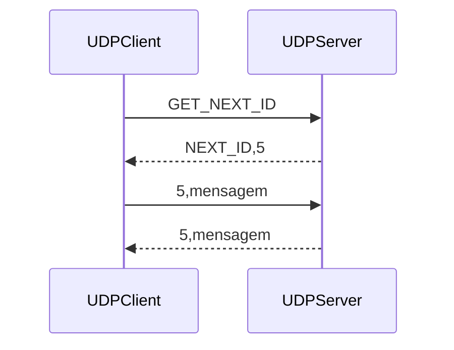
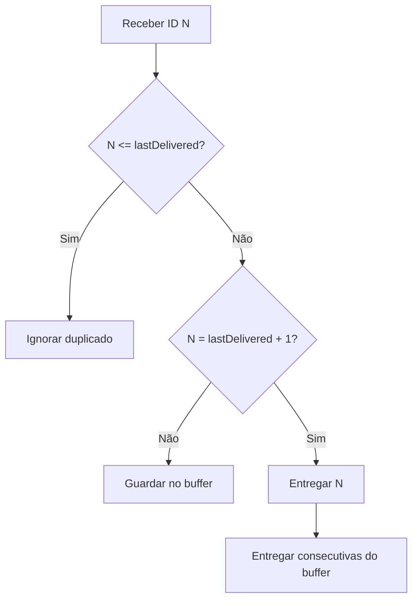

# Arquitetura do cliente/servidor UDP

## Visão geral

O projeto tem dois processos Java, sem frameworks. `UDPClient` lê mensagens da
consola e envia datagramas para `localhost:6789`. `UDPServer` valida cada
datagrama, ordena as mensagens e responde ao endereço e porto de origem.

UDP preserva os limites de cada mensagem, mas não cria uma ligação nem garante
entrega ou ordem. O socket do cliente usa um timeout de 3000 ms para que uma
resposta perdida ou um servidor parado não bloqueiem a aplicação.

## Responsabilidades

### Cliente

- escolhe o modo manual ou automático;
- valida texto vazio e IDs manuais;
- no modo automático, consulta o servidor antes do primeiro envio e sempre que
  volta a entrar nesse modo;
- só avança o contador após uma confirmação coerente;
- trata `waitingfor` e timeout sem terminar o processo.

### Servidor

- valida comandos e mensagens de dados;
- mantém `lastDelivered`, o ID mais alto já entregue em sequência;
- mantém `mensagensTemporarias`, indexado por ID, para lacunas na sequência;
- ignora IDs já entregues e não substitui uma mensagem temporária por um
  duplicado;
- calcula sempre `nextId` como `lastDelivered + 1`.

Existe uma sequência global em memória para o servidor inteiro. Não há uma
sequência independente por cliente e não há persistência em disco. A execução é
de uma só thread: cada datagrama é processado completamente antes do seguinte.

## Entrega ordenada

Se chegar exatamente `lastDelivered + 1`, o servidor entrega essa mensagem e
remove do buffer todos os IDs consecutivos seguintes. Se chegar um ID maior,
guarda-o. Se chegar um ID menor ou igual, identifica-o como antigo/duplicado.

## Fluxos dos modos

No modo manual, o utilizador escreve primeiro o payload e depois um ID positivo.
O servidor continua a decidir se a mensagem pode ser entregue, guardada ou
ignorada.

No modo automático, o contador não começa num valor codificado no cliente. O
cliente envia `GET_NEXT_ID`; a resposta `NEXT_ID,n` substitui o valor local. O
ID avança após o eco de confirmação. Uma resposta `waitingfor` volta a alinhar o
contador com o servidor: pode fazê-lo avançar após uma confirmação perdida ou
recuar após um restart do servidor.

Quando o servidor reinicia, `lastDelivered` regressa a zero. Ao entrar novamente
no modo automático, o cliente consulta o servidor e passa a usar o ID 1. Se já
estava nesse modo, a primeira resposta `waitingfor,1` também corrige o contador.
